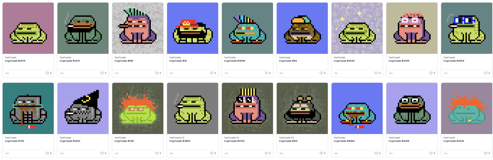

<kbd></kbd>

# TestToadz - ERC-721 Testnet Faucets

The SameToadz smart contract at [0x07e5ce0f8f](https://etherscan.io/address/0x07e5ce0f8fa46031a1dcc8cb2530f0a52019830d#code) has been renamed to [TestToadz](contracts/TestToadz.sol), compiled with [OpenZeppelin v4.3.2](https://github.com/OpenZeppelin/openzeppelin-contracts/releases/tag/v4.3.2) and deployed to 0xd000f000aa1f8accbd5815056ea32a54777b2fc4 on the following Ethereum testnets:

* [Ropsten](https://ropsten.etherscan.io/address/0xd000f000aa1f8accbd5815056ea32a54777b2fc4#writeContract)
* [Kovan](https://kovan.etherscan.io/address/0xd000f000aa1f8accbd5815056ea32a54777b2fc4#writeContract)
* [Rinkeby](https://rinkeby.etherscan.io/address/0xd000f000aa1f8accbd5815056ea32a54777b2fc4#writeContract)
* [Goerli](https://goerli.etherscan.io/address/0xd000f000aa1f8accbd5815056ea32a54777b2fc4#writeContract)
* [xDai](https://blockscout.com/xdai/mainnet/address/0xD000F000Aa1F8accbd5815056Ea32A54777b2Fc4/contracts)

Mint up to 3 TestToadz a time (with a maximum of 20 per account) by clicking **Connect to Web3** (select appropriate testnet) on the appropriate EtherScan testnet page listed above, entering a quantity between 1 and 3 in the **mint(...)** function, clicking **Write** and confirming the transaction.

You can view your Rinkeby "TestToadz" and Goerli "TestToads V2" in [https://testnets.opensea.io/account](https://testnets.opensea.io/account).

You may find these NFTs useful for your your testing.

 

 

Enjoy!

(c) BokkyPooBah / Bok Consulting Pty Ltd - Nov 2021. The smart contract is a mix of MIT & GPL3 Licence. Not affiliated with [https://cryptoadz.io/](https://cryptoadz.io/) or SameToadz. Some images and data copyright their respective owners. DYOR.
